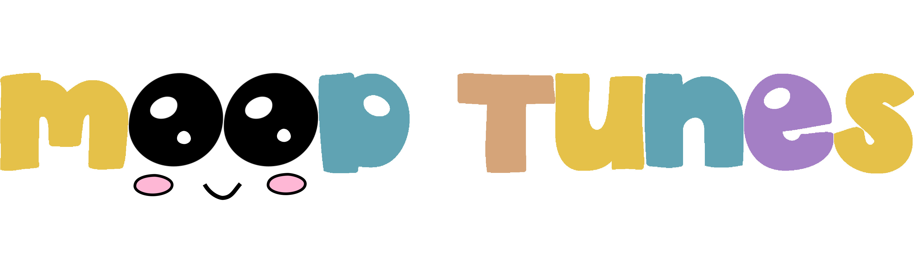
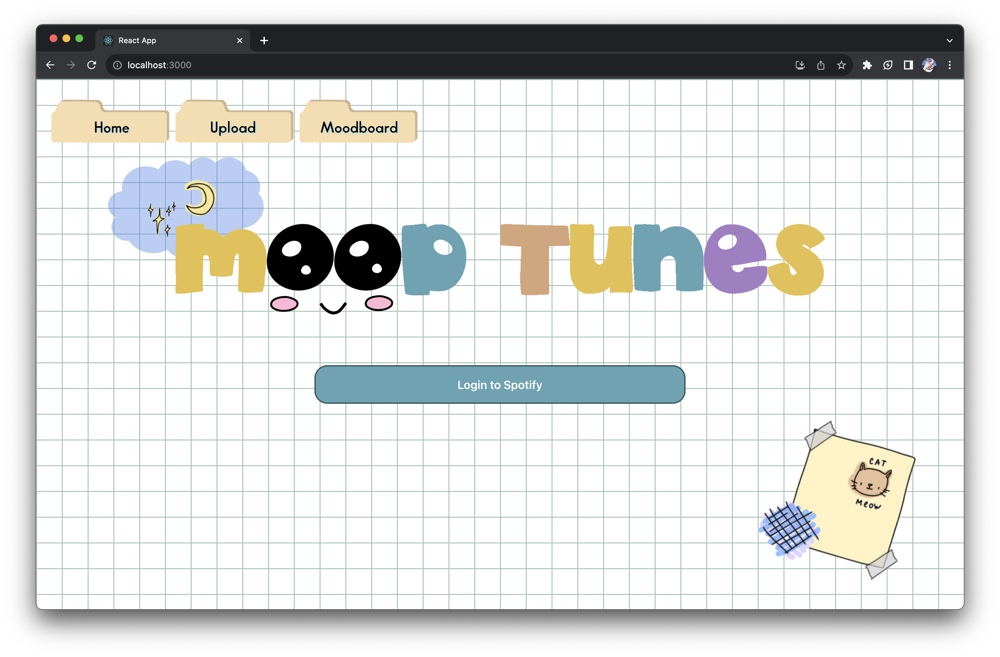
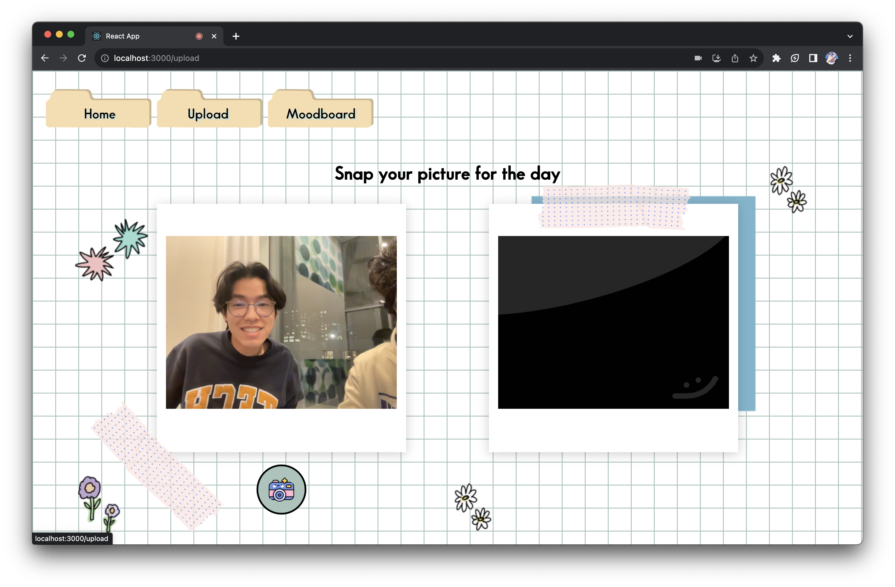
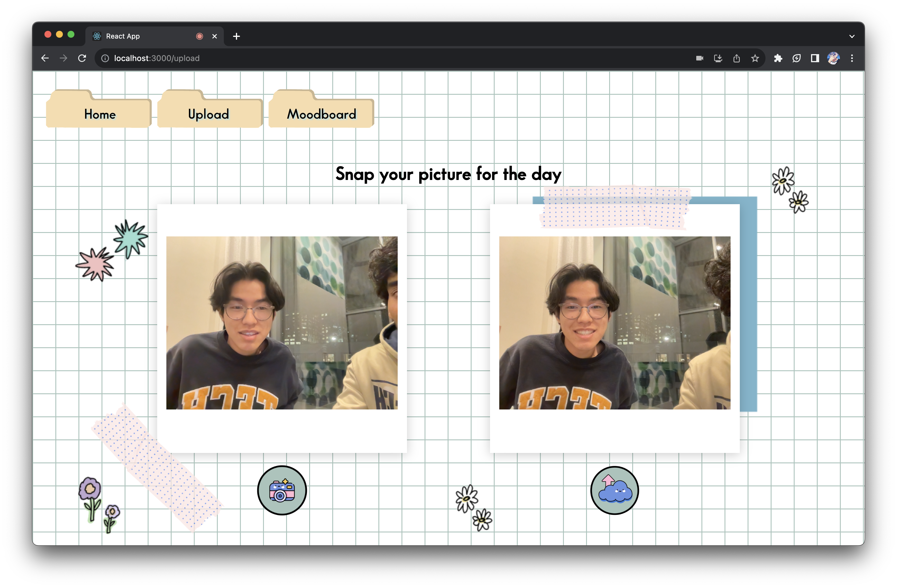
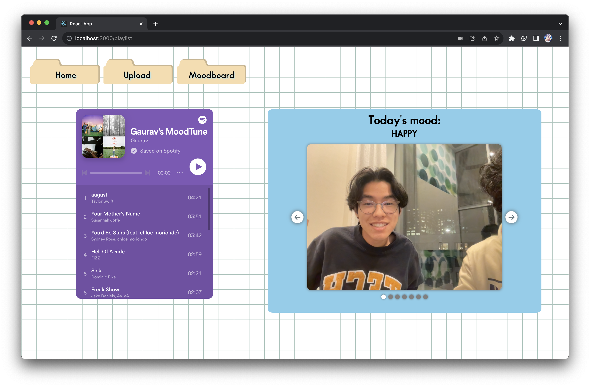

[![Contributors][contributors-shield]][contributors-url]
[![Forks][forks-shield]][forks-url]
[![Stargazers][stars-shield]][stars-url]

 

  

<h3 align="center">MoodTunes</h3>

  

    Embrace your emotions, one tune at a time
     
    <a href="https://youtu.be/fxdVDwkRnDM?si=lHIAr6joeABU_IYx">View Demo</a>
    ·
    <a href="https://devpost.com/software/moodtunes-v3tj7w">Devpost</a>
    ·
    <a href="https://hack.gt/">HackGT X</a>
  

<!-- TABLE OF CONTENTS -->

  
Table of Contents

  <ol>
    <li>
      <a href="#about-the-project">About The Project</a>
      <ul>
        <li><a href="#inspiration">Inspiration</a></li>
        <li><a href="#what-it-does">What It Does</a></li>
        <li><a href="#how-we-built-it">How We Built It</a></li>
        <li><a href="#challenges-we-ran-into">Challenges We Ran Into</a></li>
        <li><a href="#accomplishments-that-were-proud-of">Accomplishments That We're Proud Of</a></li>
        <li><a href="#what-we-learned">What We Learned</a></li>
        <li><a href="#whats-next-for-moodtunes">What's Next for Moodtunes</a></li>
      </ul>
    </li>
    <li><a href="#screenshots">Screenshots</a></li>
    <li><a href="#demo">Demo</a></li>
    <li><a href="#built-with">Built With</a></li>
  </ol>

## About the Project
### Inspiration
As Jean-Michel Basquiat once said, “Art is how we decorate space, but music is how we decorate time.” Many of us use Spotify on a daily basis to listen to our favorite songs, and the songs we listen to reflect our present mood and emotions. Sometimes, we listen to sad music to validate our feelings when we're down. Other times, we’re so happy that we want to dance to celebratory music. Regardless of the mood, there is always a song that perfectly encapsulates how we feel.

While considering HackGT’s theme “Journal of Memories”, we thought there would be no better way to preserve our memories than through music. In order to help people conveniently keep a journal of their daily mood represented through a song, we developed Moodtunes – an application that uses a highly accurate Machine Learning model to create a personalized Spotify playlist over time based on a user’s mood through the days.

Our application allows users to build a playlist as a keepsake, where listening to songs saved by their past selves can create a rush of nostalgia and remind them of how far they've come. We hope that by journaling through Moodtunes, users can use music to cherish their personal growth and look toward the future.

### What It Does
On the homepage, users can sign into their Spotify account so that a MoodTunes playlist can be created in their account. After that, the user can take a picture of their face in order to identify their current mood. From here, users are greeted with the MoodBoard, a dashboard displaying their Moodtunes playlist, current mood, and an image gallery displaying a chronicle of their mood & most recent mood photos. The personalized Moodtunes playlist starts with a few songs but grows as an individual uses the app over time. The carousel of mood photos updates as the user takes more photos, with the most recent ones staying at the front.

### How We Built It
The frontend of MoodTunes was implemented through ReactJS. We set up three main webpages: Home, Upload, and MoodBoard. The Home page prompts users to log into their Spotify accounts so a token can be generated and sent to the backend using the Axios client for account access. Upon a successful login, the user is directed to the Upload page, where they can create entries in their playlist-journal. The page acts as a photobooth, where the user can use the webcam and take snapshots of their current mood: presently, the recognized moods are happy, sad, neutral, angry, and fearful. The resulting picture is shown on the page, and once the user is satisfied with their entry, they can submit the image, which is then sent to the backend for mood analysis. Once the backend sends the mood results back to the webpage, the information is presented on the user’s MoodBoard. This page includes the user’s Moodtunes updated playlist, a blurb recording the recognized mood of the day, and a recap carousel of some of the latest photos that were previously submitted.

The backend of Moodtunes was created using Python Flask. Our backend acts as RESTful API allowing the frontend to make POST and GET calls to send and receive data. On login, the backend stores the Spotify token such that the user’s account can be accessed. For image mood detection, the backend calls an Emotion Recognition Model built by Luxand Cloud. Using this mood, using an algorithm developed by our team, this mood is translated into Spotify song recommendation based on parameters such as energy, valence, tempo, and loudness. This data is also stored in the backend in JSON format such that it persists for each user.

### Challenges We Ran Into

#### Training the Model
In our initial approach to the problem, we wanted to build and train a Machine Learning model for mood detection ourselves. We trained three different models and record the model performance. The most successful of the three we implemented into our Flask backend for testing purposes. We compared this model’s performance to an Emotion Recognition Model by Luxand Cloud built with similar architecture to the models we were training.
While both were functional and highly efficient, our self-built model relied on grayscale photos of a square-dimension. We ultimately decided we needed to prioritize colored-photos for better user experience, thus choosing the latter model.

#### Frontend and Backend Communication
Our frontend is built with React and backend with Python, so there was a challenge with connecting the two. Initially, we were considering our backend to be built in NodeJS; however, with the ML mood detection and the fact that most team members were not comfortable in JS, we decided to go with Python. We ultimately decided to treat the Flask backend as an API, making POST calls to it, which proved to be difficult. State management, tooling & environment setup, and deployment were just some of the challenges we faced. All in all, this tasking required a lot of perusing documentation and Youtube tutorials to get the issues ironed out.

#### Fluency in React 
Coming into the hackathon, most of our teammates had little to no experience building frontend interfaces. We ran into many issues, such as creating custom images as buttons, setting up the live image-capturing functionality, page and element orientation, spinner buttons, and making the webpage aesthetically on-theme. Most of the resolutions to these roadblocks depended on a combination of our debugging skills and categorizing tasks depending on who learned a certain skill first. For instance, when one of the team members learned how to orient elements on a page using CSS properties, they became the main person to handle related tasks. Simultaneously, another member was responsible for designing some of the images and vectors shown on the webpage.

### Accomplishments That We're Proud Of
#### Song Recommendations & Mood Playlist
Watching our abstract idea come to life has been a very rewarding process: as the first users of our website, every attempt to add more functionality was done in earnest. Moreover, it is validating to see the mission of our application adopted by our groups’ use of it; through all the testing and trying of the app, every team member now has a playlist full of memories that we’ve made over this past weekend.

#### Moodtunes’s Impact
Moodtunes’s potential to positively impact users' mental well-being is a testament to the capabilities of integrating cutting-edge technology with everyday life and how simple it is to make beneficial technologies accessible. We're proud of Moodtunes because it provides a unique and enjoyable way for individuals to track and manage their emotional states. Moodtunes not only makes improving mental health a fun and accessible pursuit by encouraging self-reflection through music, but also contributes to a more emotionally balanced and resilient society.

### What We Learned

#### Technical
Our team learned a variety of hard and soft skills during the project. Most of our team had never touched React before, let alone build a frontend for an application. We learned a ton about component composition, state management, context API, and efficient UI rendering in React during the hackathon.

Furthermore, our team acquired a deeper understanding of Machine Learning concepts related to training and evaluating the performance of the mood detection model. We learned how to use hyperparameter tuning for model optimization, as well as model layer selection. Although these models we trained weren’t able to make it to the final product, the knowledge our team gained is invaluable.

#### Soft Skills
Apart from hard skills, we improved our collaboration and communication skills while working on the project. Parallelization is an important concept for hackathons and it was something we had to learn quickly in order to ensure we were efficient with our time usage. In order to accomplish this, we used mock data for the frontend when the backend was being built, while ensuring the backend was returning data in the desired format for the frontend. This aided in easing the pain with connecting the two.

#### Social
Our team’s initial inspiration for Moodtunes was to expand classical journaling to another medium, as there have been multiple academic sources promoting the benefits of journaling for mental health. In order to emulate the journaling experience through our application, we heavily researched the intrinsic benefit of acknowledging the imperfections in life and normalizing them. 
Additionally, our team learned to create a parallel between writing in a physical journal and keeping a digital one. We thought of the idea to keep some of the snapshots that users take when generating their Moodtunes playlists; the benefits of the photo-booth functionality was supported by many studies citing the positive correlation between taking selfies and happiness: a study at UCIrvine “found that subjects in all … groups experienced increased positive moods”, where sentiments ranged from increased confidence to greater self-comfort (Bell, 2016).
Lastly, we learned a lot about the mental health benefits of music once we started to understand the Spotify recommendations algorithm and how to tune certain settings to certain emotions. We read multiple research papers studying the impacts of music on mood, and to summarize what we found, “people use music to improve their mood on a daily basis, both in everyday life” (Stewart et. al., 2019)
Throughout the entire development of Moodtunes, we realized the application had a much larger social impact than we first planned it to have. By integrating everything we learned through studies and personal experience, we were able to create an immersive digital journal that allows users to reflect and look fondly back on their past selves.

### What's Next for Moodtunes

As the future steps in the project, we can improve the song selection algorithm. Currently, we are utilizing Spotify recommendation API with 5 different parameters that vary based on the mood. Moving forward, we can add more parameters to select the most appropriate songs or even build a machine learning model to suggest songs based on mood. On the same token, we want to add more emotions that can be supported by the website such as relaxed, energetic, and excited. By broadening the range of emotions to journal, we can create an even more authentic experience for users and provide better suggestions for their playlists. 

Another important step we plan to take is increase the feature set for users to better view their mood over time. This includes a calendar to see your mood and a graph to understand how your mood has changed over the days, weeks, and years.

## Screenshots

Homepage where users can log in and connect their Spotify

 

Upload page where users can take a picture

 

Upload page before submitting picture for mood detection

 

Moodboard where users can see their current mood and MoodTunes playlist!

## Demo
https://youtu.be/fxdVDwkRnDM

## Built With
* [![React][React.js]][React-url]
* [![Flask][Flask]][Flask-url]

[React.js]: https://img.shields.io/badge/React-20232A?style=for-the-badge&logo=react&logoColor=61DAFB
[React-url]: https://reactjs.org/
[Flask]: https://img.shields.io/badge/Flask-000000?style=for-the-badge&logo=flask&logoColor=white
[Flask-url]: https://flask.palletsprojects.com/en/3.0.x/

[contributors-shield]: https://img.shields.io/github/contributors/adriencao/mood-spotify.svg?style=for-the-badge
[contributors-url]: https://github.com/adriencao/mood-spotify/graphs/contributors
[forks-shield]: https://img.shields.io/github/forks/adriencao/mood-spotify.svg?style=for-the-badge
[forks-url]: https://github.com/adriencao/mood-spotify/network/members
[stars-shield]: https://img.shields.io/github/stars/adriencao/mood-spotify.svg?style=for-the-badge
[stars-url]: https://github.com/adriencao/mood-spotify/stargazers
